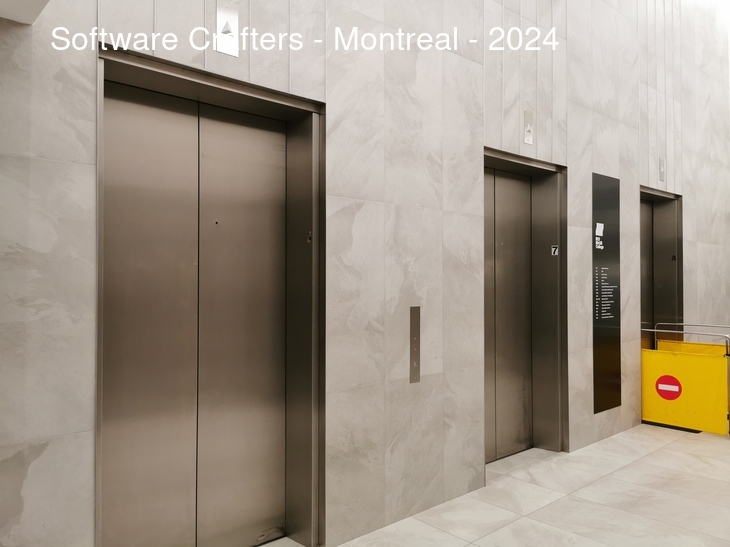
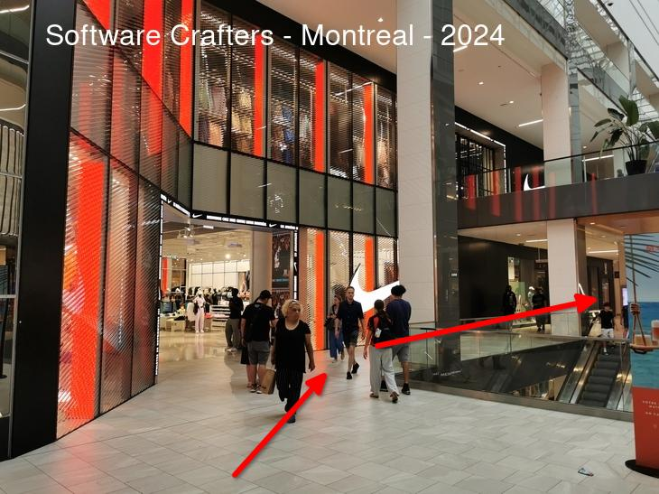
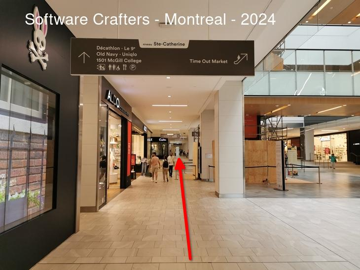

# Software Crafters - Montreal

## TEKSystems

1801 Av. McGill College #1100, Montréal, QC H3A 3T2

[OpenStreetMap](https://osm.org/go/cIrNvYEnN?node=2428616368) - [Google Maps](https://goo.gl/maps/4gE8E9XnAg9HFN2o9)

[back](./index.html)

## OVH Cloud

1801 Av. McGill College #800, Montréal, QC H3A 3T2

[OpenStreetMap](https://osm.org/go/cIrNvYEnN?node=2428616368) - [Google Maps](https://goo.gl/maps/4gE8E9XnAg9HFN2o9)

[back](./index.html)

## Directions

<!-- TOC -->
- [Software Crafters - Montreal](#software-crafters---montreal)
  - [TEKSystems](#teksystems)
  - [OVH Cloud](#ovh-cloud)
  - [Directions](#directions)
    - [Depuis le croisement du boulevard de Maisonneuve Ouest et de l'avenue McGill College](#depuis-le-croisement-du-boulevard-de-maisonneuve-ouest-et-de-lavenue-mcgill-college)
    - [Depuis le boulevard Sainte-Catherine Ouest](#depuis-le-boulevard-sainte-catherine-ouest)
    - [Depuis le métro](#depuis-le-métro)
<!-- TOC -->

### Depuis le croisement du boulevard de Maisonneuve Ouest et de l'avenue McGill College

Montez au 11e étage.

### Depuis le boulevard Sainte-Catherine Ouest

Par l’entrée la plus à gauche quand vous êtes face au centre Eaton.

Prendre à gauche après l’entrée.

Continuer tout droit.

Tourner à gauche avant le magasin de lunettes.

Monter au 11e étage.

### Depuis le métro

Suivre la sortie "Centre Eaton de Montreal".

Avec la SAQ a votre droite, prendre le premier couloir a droite.

Avec le magasin Bell a votre droite, prendre a droite puis l'escalator pour monter.

En haut des escalators, le couloir se trouve sur votre droite
mais il faut faire le tour comme sur le plan ci-dessous.

Monter au 11e étage.

[back](./index.html)
